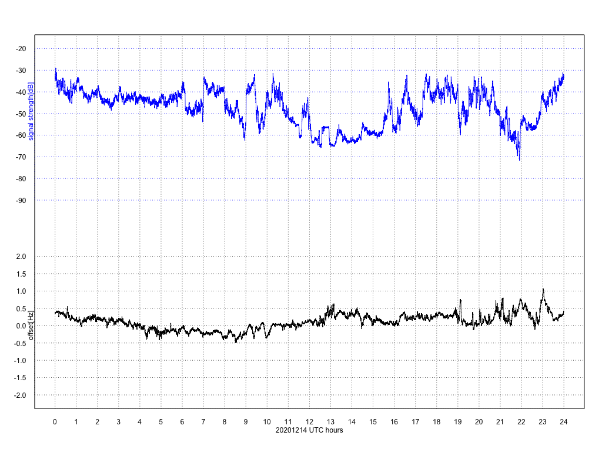

# hamsci-202012-freqdata

This repository contains [HamSCI December 2020 Eclipse Festival of Frequency Measurement](https://hamsci.org/december-2020-eclipse-festival-frequency-measurement) result from my home station JJ1BDX in Setagaya City, Tokyo, Japan at Grid Locator PM95tp.

## Measurement date and time

9-DEC-2020 0000UTC - 16-DEC-2020 2359UTC

## Measurement equipments

* Antenna: 2.2m-length 30m-band whip at 8m height above the ground
* SDR frontend: Airspy HF+ Discovery, without GPSDO
* SDR software: [airspy-fmradion](https://github.com/jj1bdx/airspy-fmradion) 20201204-0
* Recorded 8kHz-rate WAV files at approx. 9999kHz USB
* Airspy HF+ Discovery offset: 1.1311 Hz higher (i.e., 10MHz was mapped to 998.8689Hz), measured by Leo Bodnar mini GPSDO

## Measured data

* Estimated frequency of received AM carrier for the standard frequency stations (BPM, WWVH, WWV were observable)
* Estimated signal strength (by airspy-fmradion dBFS IF strength reading)
* GPSDO offset measured after the frequency measurement on 17-DEC-2020
* Raw data set is available at [the designated DropBox folder](https://www.dropbox.com/sh/n7auhzxflu0cz3j/AADRhs8OS2dq1BkGtcF3u1sqa?dl=0)

## Files in this repository

* aggregated-values/: merged data of from the measured-values/ directory files, and the calculation/estimation/visualization R code
* gpsdo-values/: GPSDO-based calibration data
* graphs/: summary graphs by date
* measured-values/: measured data by analyzing the WAV files
* measurement-code/: the WAV file analysis code in [csdr](https://github.com/ha7ilm/csdr) and C

## Acknowledgment

* Kristina Collins, KD8OXT
* [HamSCI](https://www.hamsci.org) people and community
* [Pepabo R&D Institute, GMO Pepabo, Inc.](https://rand.pepabo.com), for their financial and moral support

## LICENSE

CC0

## Measurement result summary example as the graph for 14-DEC-2020

